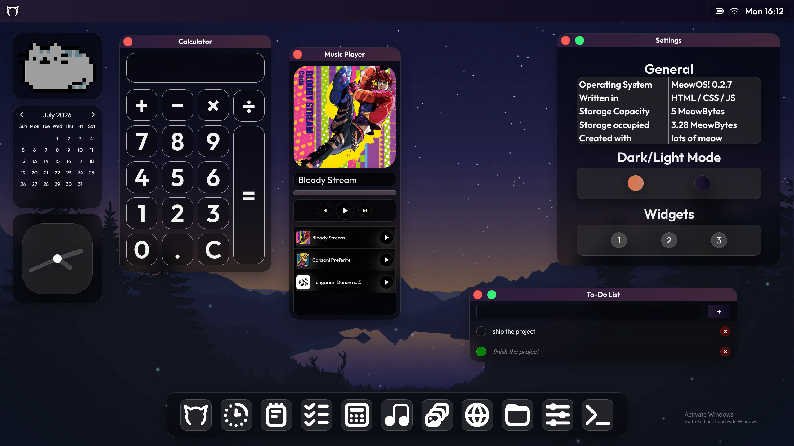

# MeowOS!

A web based operating system! You can do stuff with it, using the apps listed below!

Click this link to try this out:  
https://charliethecatmeow.github.io/WebOS/

## Apps:
- Intro
- Notes
- Stopwatch
- To-Do List
- Calculator
- Music Player
- Gallery
- Files
- Settings
- Terminal

## Features
- Clock
- Loading Screen
- Start Menu
- Search Menu (top left, click the Logo)
- Control Center (top right, click the clock thingy)
- Widgets (Toggles in settings)
- Interactive elements

Yes all very exciting I know.

## This website is intended to be used in a 16:9 aspect ratio. Other aspect ratios may not be supported.

## Screenshots:

## Why I chose this project
I chose this out of all the missions mainly because of its freedom to do things.  
You can build a small WebOS, sure, but you can also expand it further.   
It gives you the freedom to build almost anything. 

## Issues I had
Everything related to the windows. Whether it be maximizing them, moving them or opening them,   
there were always 200 bugs accompaning it. >:(

## What I learned:
I started this project as a total beginner. I slowly learnt the basics following the provided guide. A couple hours later and here it is.  
I learned how to use stylesheets and scripts to create a website. I learned Javascript and CSS as well as how websites are built. 

Credits to Louis Coyle for the Background image (very pretty).  
Credits to Daisuke Hasegawa, Coda and Yugo Kanno for the music
