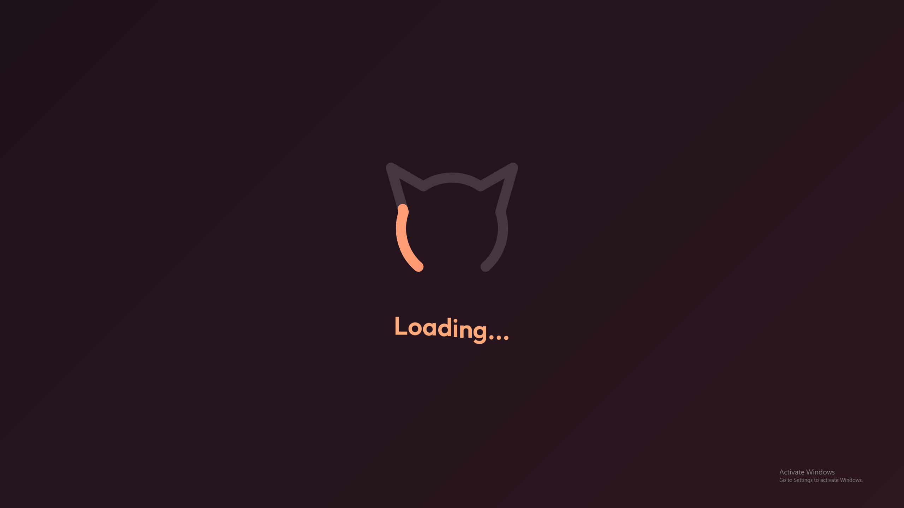
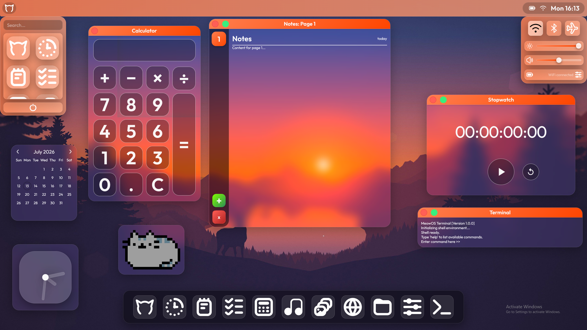
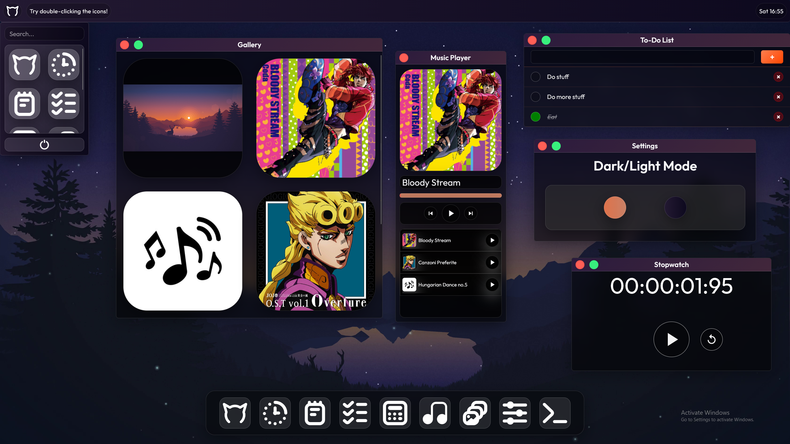

# MeowOS!

A web based operating system! You can do stuff with it, using the apps listed below!

## Apps:
- Intro
- Notes
- Stopwatch
- To-Do List
- Calculator
- Music Player
- Gallery
- Files
- Settings
- Terminal

## Features
- Clock
- Loading Screen
- Start Menu
- Search Menu (top left, click the Logo)
- Control Center (top right, click the clock thingy)
- Widgets (Toggles in settings)
- Interactive elements

Yes all very exciting I know.

## This website is intended to be used in a 16:9 aspect ratio. Other aspect ratios may not be supported.

## Screenshots:

Credits to Louis Coyle for the Background image (very pretty).  
Credits to Daisuke Hasegawa, Coda and Yugo Kanno for the music